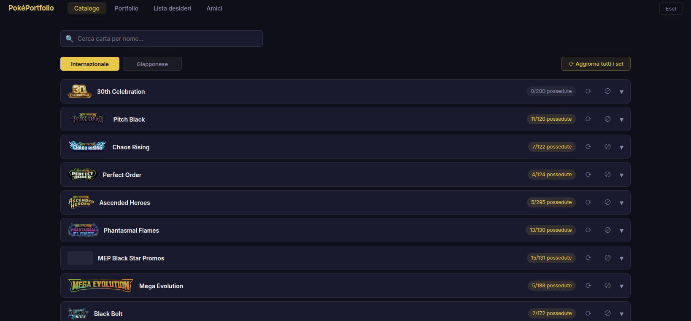
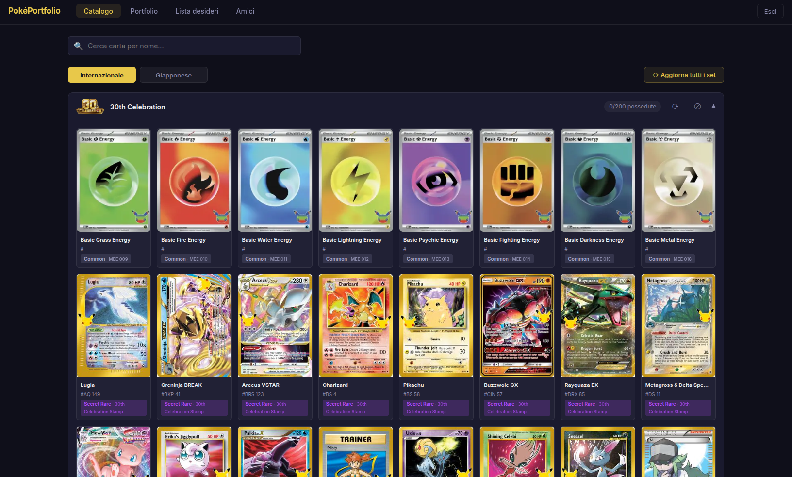
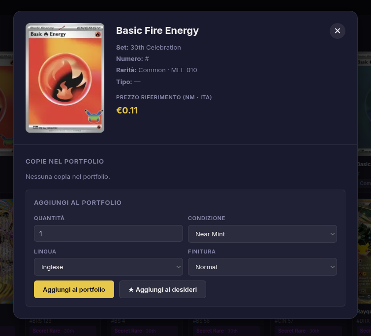
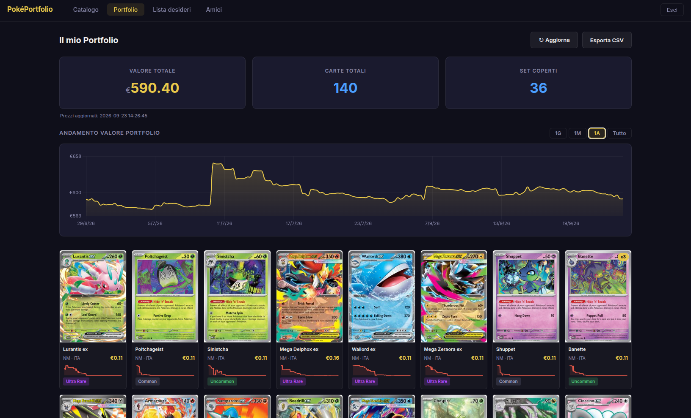
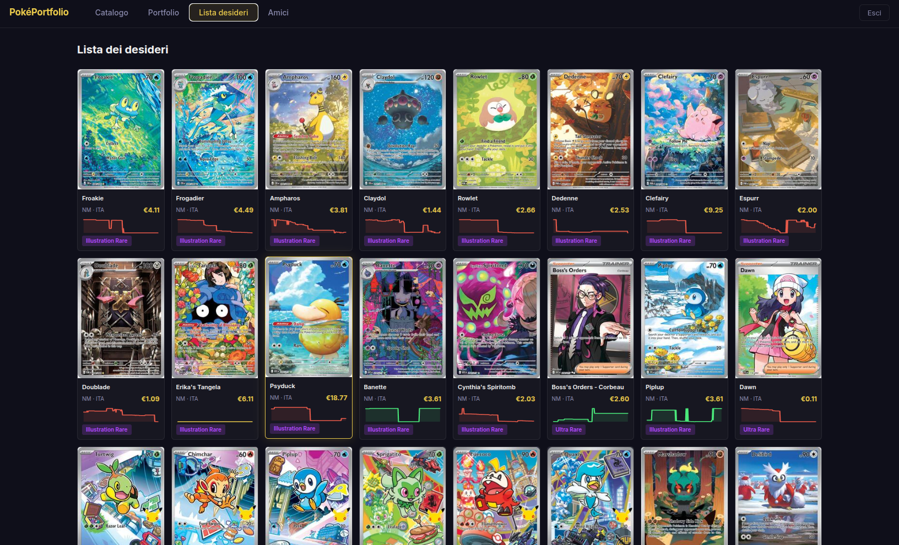
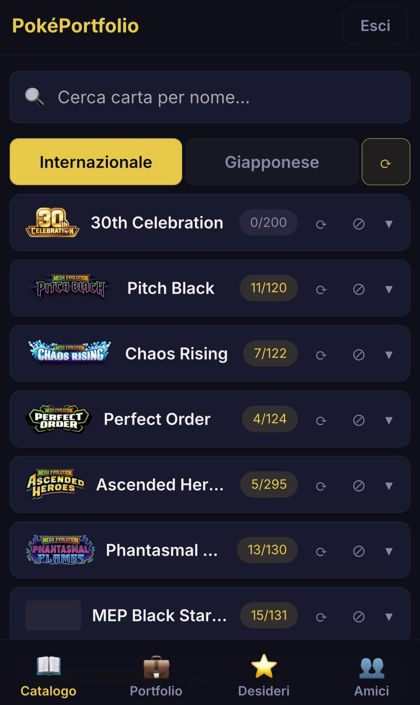
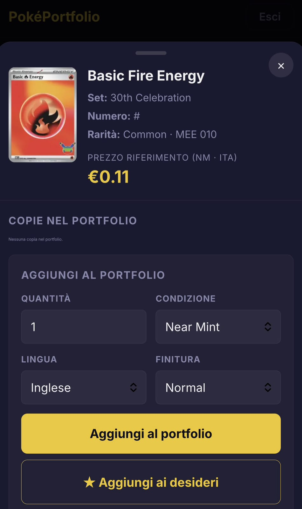
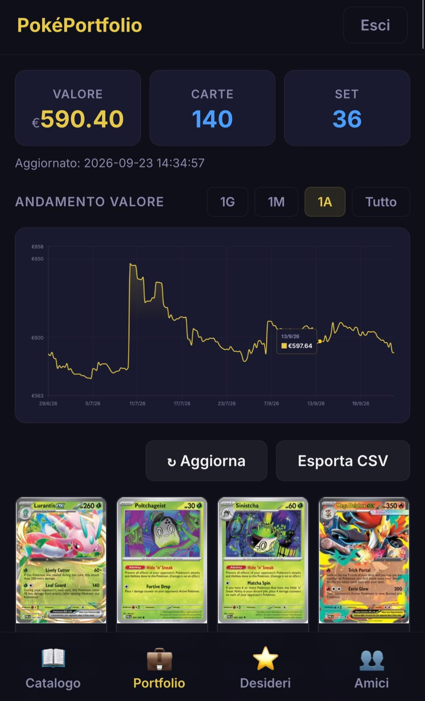

# PokéPortfolio

Web app per gestire la propria collezione di carte Pokémon: catalogo completo dei set, portfolio con valore aggiornato dai prezzi di **CardTrader**, lista dei desideri e condivisione della collezione con gli amici.

Gira interamente su **Google Apps Script**: niente server da mantenere. I dati vivono in Google Sheets (un foglio master condiviso più un foglio personale per ogni utente).



---

## Funzionalità

### Catalogo
- Tutti i set Pokémon presenti su CardTrader, divisi fra **Internazionale** e **Giapponese**, ordinati per data di uscita e con il logo ufficiale.
- Le carte di un set si caricano solo quando lo espandi. Ogni set mostra il contatore delle carte possedute ("12/165").
- **Ricerca** delle carte per nome.
- Badge sulle miniature per le copie possedute e per le carte nella lista dei desideri (❤).
- **Set nascosti**: con ⊘ togli dalla vista un set che non ti interessa. La lista è personale di ogni account e si ripristina dal blocco "Set nascosti" in fondo al catalogo.
- **Aggiornamento dei set**: ⟳ riscarica carte e immagini di un singolo set, mentre "Aggiorna tutti i set" ricontrolla l'intero catalogo e riscrive solo i set cambiati. Serve per i set usciti da poco e salvati quando erano ancora incompleti.



### Scheda carta
- Scegli condizione, lingua e finitura e aggiungi la carta al portfolio o alla lista dei desideri.
- **Prezzo in tempo reale** dal marketplace di CardTrader per quella variante.
- Grafico dell'andamento del prezzo nel tempo.



### Portfolio
- Valore totale della collezione, numero di carte e numero di set.
- Grafico dell'andamento del valore nel tempo, con filtro per periodo.
- Mini-grafico del prezzo accanto a ogni carta.
- Export in **CSV**.



### Lista dei desideri
Le carte che vorresti, con il loro prezzo aggiornato e la sua storia. La lista non entra nel valore del portfolio.



### Amici
Consulti in sola lettura il portfolio degli altri utenti registrati.

### Mobile
Un'interfaccia dedicata per smartphone, con la barra di navigazione in basso e la scheda carta che si chiude trascinandola verso il basso.

<p align="center">
  
  
  
</p>

---

## Come funziona

```
┌──────────────┐   google.script.run   ┌───────────────────────┐
│  Browser     │ ────────────────────▶ │  Google Apps Script   │
│  desktop /   │                       │  (Script/*.js → .gs)  │
│  mobile      │ ◀──────────────────── │                       │
└──────────────┘                       └───────┬───────┬───────┘
                                               │       │
                         ┌─────────────────────┘       └──────────────┐
                         ▼                                            ▼
             ┌────────────────────────┐                  ┌────────────────────┐
             │  Foglio MASTER         │                  │  API CardTrader    │
             │  utenti, SET_CACHE,    │                  │  set, carte,       │
             │  CACHE_CARDS,          │                  │  prezzi            │
             │  BATCH_STATE           │                  └────────────────────┘
             └────────────────────────┘
             ┌────────────────────────┐
             │  Foglio per utente     │
             │  CONFIG, PORTFOLIO,    │
             │  WISHLIST, storici     │
             └────────────────────────┘
```

- **Foglio master**: il primo foglio contiene gli utenti (username, hash SHA-256 della password, ID del foglio personale, API key CardTrader). Qui stanno anche il catalogo condiviso (`SET_CACHE`, `CACHE_CARDS`) e lo stato dei processi automatici (`BATCH_STATE`).
- **Foglio personale**: viene creato alla registrazione, in una cartella Drive dedicata. Contiene `CONFIG` (impostazioni, compresi i set nascosti), `PORTFOLIO`, `WISHLIST` e gli storici dei prezzi.
- **Processi automatici**: la sync del catalogo e l'aggiornamento dei prezzi di tutti gli utenti partono da trigger temporizzati. Apps Script ferma ogni esecuzione dopo 6 minuti, quindi lavorano a turni: salvano a che punto sono arrivati in `BATCH_STATE` e si riprogrammano da soli per il turno successivo.
- **Sessioni**: al login viene generato un token che dura 24 ore.

### Struttura del repository

| Percorso | Contenuto |
|---|---|
| `Script/Codice.js` | Punto di ingresso (`doGet`), accesso ai fogli, configurazione |
| `Script/Auth.js` | Registrazione, login e sessioni |
| `Script/Cards.js` | Sync del catalogo da CardTrader, lettura dei set, set nascosti e aggiornamento dei set |
| `Script/Prices.js` | Prezzi in tempo reale, aggiornamento prezzi a turni, dashboard |
| `Script/Portfolio.js` | Gestione del portfolio ed export |
| `Script/Wishlist.js` | Gestione della lista dei desideri |
| `Script/Friends.js` | Portfolio degli amici in sola lettura |
| `Script/Utils.js` | Funzioni di supporto comuni |
| `HTML/desktop.html` | Interfaccia e stile desktop |
| `HTML/mobile.html` | Interfaccia e stile mobile |
| `HTML/script.html` | JavaScript del browser, condiviso da desktop e mobile |

---

## Installazione

1. **Foglio master.** Crea un Google Sheet: il primo foglio ospiterà gli utenti. Aggiungi due fogli chiamati `SET_CACHE` e `CACHE_CARDS` (le intestazioni le crea la prima sync). `BATCH_STATE` viene creato in automatico.
2. **Progetto Apps Script.** Crea un nuovo progetto su [script.google.com](https://script.google.com) e copia i file:
   - ogni `Script/<Nome>.js` diventa un file script `<Nome>.gs`;
   - ogni `HTML/<nome>.html` diventa un file HTML `<nome>`, senza estensione: `desktop`, `mobile`, `script`.
3. **Configurazione.** In `Script/Auth.js` imposta `ID_FOGLIO_MASTER_UTENTI` con l'ID del tuo foglio master.
4. **API key CardTrader.** Ogni utente può inserire la propria in fase di registrazione. Per chi non la inserisce, aggiungi in `BATCH_STATE` una riga `default_token` con una key di riserva.
5. **Trigger.** Da *Attivatori* crea due trigger temporizzati:
   - `syncCatalog` (per esempio una volta al giorno), che scarica i set nuovi;
   - `updateAllUsersAllPrices` (per esempio ogni notte), che aggiorna i prezzi e gli storici.
6. **Deployment.** *Esegui il deployment → Nuovo deployment → App web*, con "Esegui come: **io**" e l'accesso che preferisci. Il link `/exec` apre la versione desktop, `/exec?mobile=1` quella mobile.

> **Nota:** dopo ogni modifica al codice crea una nuova versione del deployment (oppure usa il link `/dev` per i test), altrimenti `/exec` continua a servire la versione precedente.

---

## Crediti

- Dati di carte e prezzi: [CardTrader API](https://www.cardtrader.com/docs/api/full/reference)
- Loghi e date dei set: [PokemonTCG/pokemon-tcg-data](https://github.com/PokemonTCG/pokemon-tcg-data)
- Grafici: [Chart.js](https://www.chartjs.org/)

Pokémon e i nomi correlati sono marchi di Nintendo, Creatures Inc. e GAME FREAK inc. Questo progetto non è affiliato né approvato da loro.
