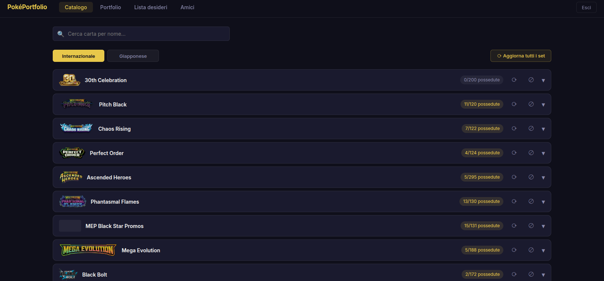
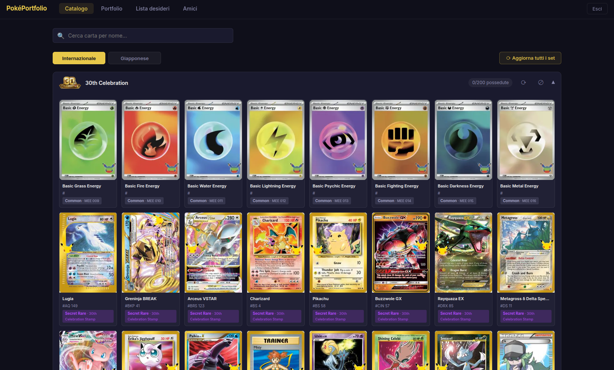
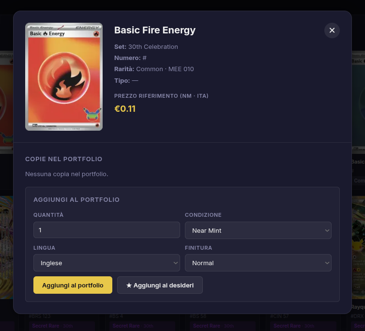
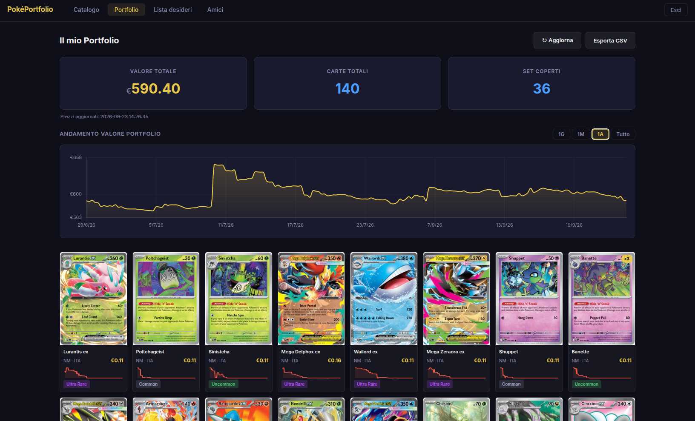
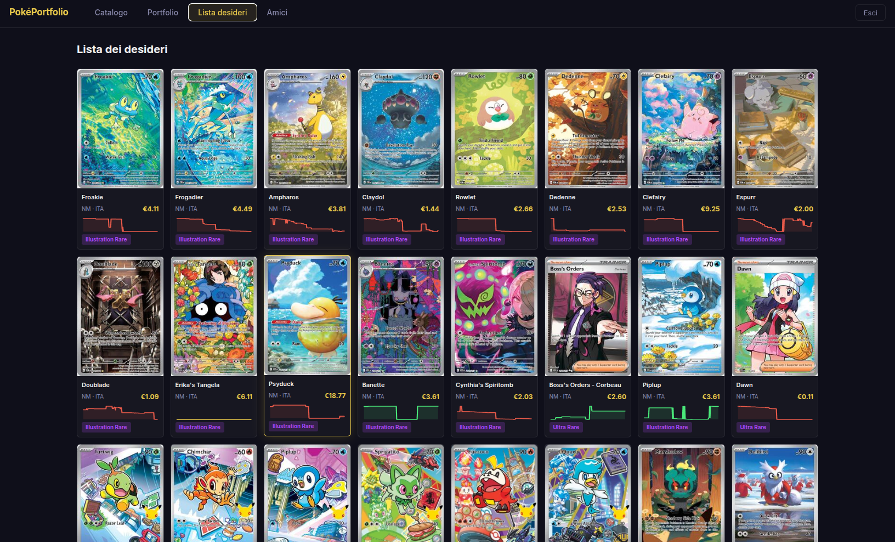
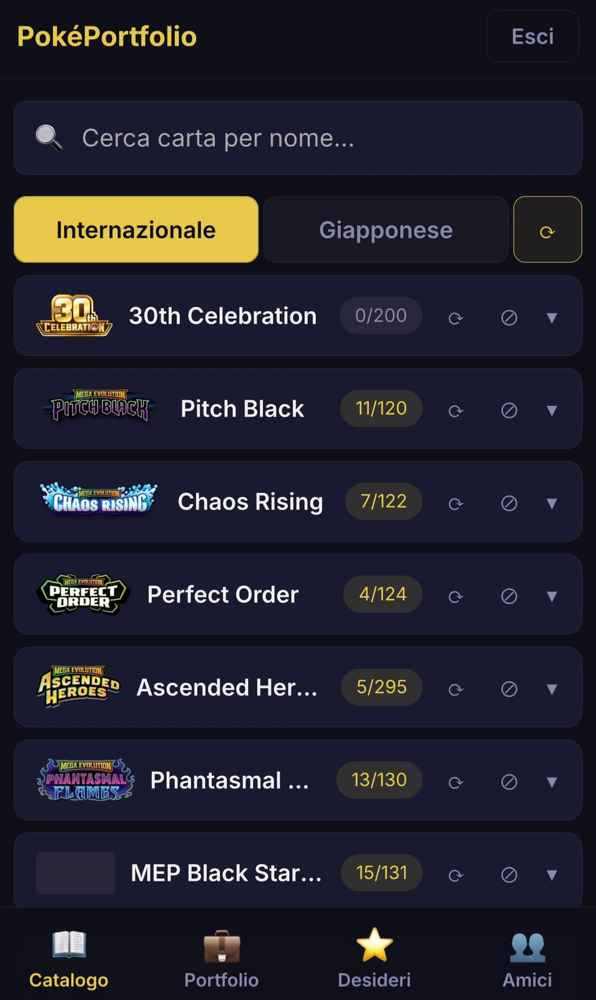
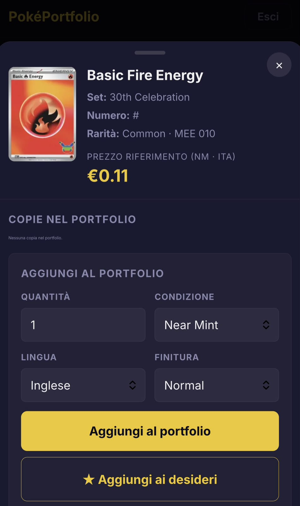
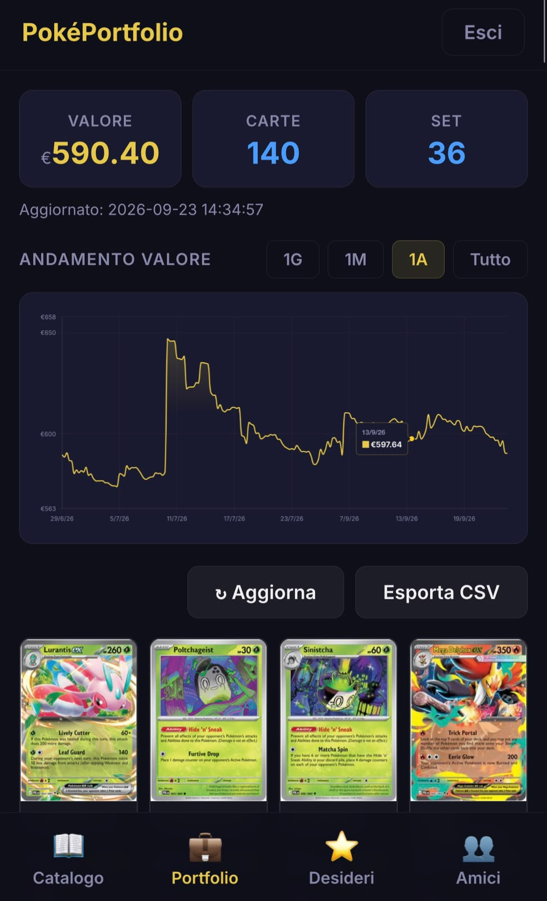

# PokéPortfolio

Web app per gestire la tua collezione di carte Pokémon. Hai il catalogo completo dei set, il valore della collezione aggiornato con i prezzi di **CardTrader**, la lista dei desideri e la collezione dei tuoi amici.

> **Questa pagina è la versione self-hosted**: l'app gira su un server tutto tuo (branch `feat/backend-server`). Se preferisci non avere un server, c'è la [versione Google Apps Script](https://github.com/LukinoDeveloppino/PokePortfolio/tree/master).



---

## Due versioni

PokéPortfolio esiste in due versioni. Fanno le stesse cose, cambia dove girano.

| | Google Apps Script | Self-hosted (questa pagina) |
|---|---|---|
| **Dove gira** | Nel tuo account Google | Su un server tuo (un VPS Oracle Cloud gratuito) |
| **Dove stanno i dati** | In fogli Google Sheets nel tuo Google Drive | In un database PostgreSQL sul server |
| **Costo** | 0 € | 0 € (risorse gratuite di Oracle) |
| **Difficoltà** | Bassa: copi dei file e premi qualche pulsante nel browser | Media: serve usare il terminale e creare un server |
| **Velocità** | Più lenta, con i limiti di Google | Più veloce, prezzi aggiornati due volte al giorno |
| **Adatta a** | Chi vuole provarla subito, da solo o con pochi amici | Chi vuole un'app sempre accesa con un indirizzo suo |
| **Guida** | [Branch `master`](https://github.com/LukinoDeveloppino/PokePortfolio/tree/master) | [Installare la tua copia](#installare-la-tua-copia), qui sotto |

---

## Cosa sa fare

- **Catalogo**: tutti i set Pokémon presenti su CardTrader, internazionali e giapponesi, con logo, ricerca per nome e contatore delle carte che possiedi ("12/165"). Puoi nascondere i set che non ti interessano.
- **Scheda carta**: scegli condizione, lingua e finitura, vedi il prezzo in tempo reale e il grafico del prezzo nel tempo.
- **Portfolio**: valore totale della collezione, grafico del valore nel tempo, export in CSV.
- **Lista dei desideri**: le carte che vorresti, con il loro prezzo.
- **Amici**: guardi la collezione degli altri utenti, in sola lettura.
- **Mobile**: un'interfaccia apposta per lo smartphone.

| Set espanso | Scheda carta |
|---|---|
|  |  |
| **Portfolio** | **Lista dei desideri** |
|  |  |

<p align="center">
  
  
  
</p>

---

## Installare la tua copia

Questa guida parte da zero. Non serve saper programmare: basta seguire i passi in ordine e copiare i comandi.

### Parole che incontrerai

| Parola | Cosa vuol dire |
|---|---|
| **Terminale** | Una finestra in cui scrivi istruzioni al computer invece di cliccare. |
| **Comando** | Una riga da scrivere (o incollare) nel terminale, seguita dal tasto Invio. |
| **VPS** o **server** | Un computer in affitto in un centro dati, sempre acceso, su cui gira l'app. |
| **SSH** | Il modo sicuro con cui il tuo PC si collega al server per dargli comandi. |
| **Chiave SSH** | Un file che fa da password per entrare nel server. Chi ce l'ha può entrare. |
| **Dominio** | Un nome facile da ricordare (come `tuonome.duckdns.org`) al posto dei numeri dell'indirizzo del server. |
| **HTTPS** | La connessione cifrata del lucchetto nel browser. Lo script la attiva da solo. |
| **API key** | Una password che permette all'app di chiedere dati a un servizio (qui CardTrader). |
| **Repository** | La cartella del progetto su GitHub, con tutto il codice. |
| **Branch** | Una versione del progetto dentro il repository. Questa versione è il branch `feat/backend-server`. |

Nei comandi, quello che è fra `<` e `>` va sostituito con il tuo valore, senza i simboli `<` e `>`. Per esempio `<IP-del-tuo-server>` diventa `1.2.3.4`.

### 0. Cosa ti serve

- Un PC con **Linux** o **macOS**. Su **Windows** va bene, con WSL (vedi il passo 1).
- Una **carta di credito o di debito**: Oracle la chiede per verificare chi sei, ma non addebita nulla se resti nelle risorse gratuite.
- Un indirizzo email.
- Circa **un'ora e mezza**. L'attivazione dell'account Oracle a volte richiede più tempo (vedi il passo 3).

**Costi: 0 €.** Il server è una macchina "Always Free" di Oracle Cloud, gratuita per sempre. Il dominio di DuckDNS e l'account CardTrader sono gratuiti.

### 1. Prepara il PC

**Su Windows** installa prima WSL, che ti dà un Ubuntu dentro Windows. Cerca "PowerShell" nel menu Start, clic destro, **Esegui come amministratore**, scrivi `wsl --install` e premi Invio. Riavvia il PC. Poi apri **Ubuntu** dal menu Start, scegli un nome utente e una password. Da qui in poi usa quella finestra e segui le istruzioni per Ubuntu.

**Apri il terminale.**
- Su Ubuntu: premi `Ctrl` + `Alt` + `T`, oppure cerca "Terminale" fra le applicazioni.
- Su macOS: premi `Cmd` + `Spazio`, scrivi "Terminale" e premi Invio.

Per incollare nel terminale usa `Ctrl` + `Shift` + `V` su Linux, `Cmd` + `V` su macOS, clic destro su WSL.

**Installa git e Node.js 22.** Git scarica il progetto, Node.js lo fa funzionare.

Su Ubuntu o Debian (anche dentro WSL), un comando alla volta. Quando chiede la password, è quella del tuo utente: mentre la scrivi non compare nulla, è normale.

```bash
sudo apt-get update
sudo apt-get install -y git curl
curl -fsSL https://deb.nodesource.com/setup_22.x | sudo -E bash -
sudo apt-get install -y nodejs
```

Su macOS: scarica Node.js 22 (versione LTS) da [nodejs.org](https://nodejs.org) e installalo con doppio clic. Poi scrivi `git --version`: se git manca, macOS ti propone di installarlo, accetta. In alternativa, se usi [Homebrew](https://brew.sh): `brew install node git`.

Controlla: `node -v` deve rispondere `v22` o un numero più alto.

**Scarica il progetto**, un comando alla volta:

```bash
git clone -b feat/backend-server https://github.com/LukinoDeveloppino/PokePortfolio.git
cd PokePortfolio
npm install
```

Ora hai la cartella `PokePortfolio`. Tutti i comandi `npm run ...` di questa guida vanno lanciati da lì: se apri un nuovo terminale, scrivi prima `cd PokePortfolio`.

Se `npm install` mostra qualche avviso (`warn`) va bene. Se finisce con `ERR!`, controlla di avere Node.js 22 con `node -v`.

### 2. API key di CardTrader

L'app prende carte e prezzi da [CardTrader](https://www.cardtrader.com). Ti serve una **API key**, cioè un codice che dà all'app il permesso di leggere i dati del tuo account CardTrader gratuito.

Registrati su cardtrader.com, apri le **impostazioni del profilo** e cerca la sezione **API**. Lì trovi un codice lungo: è la API key. Copiala in un posto sicuro.

La stessa key ti serve due volte: il server la usa per scaricare il catalogo dei set, e tu la usi per registrarti nell'app. Solo il **primo** utente, cioè tu che installi, può registrarsi con la key del server: gli altri devono usare la propria.

> Una API key è come una password: non condividerla, non incollarla in chat e non metterla su GitHub.

Ogni amico che userà l'app dovrà registrarsi con la sua API key personale.

### 3. Account Oracle Cloud

1. Vai su [oracle.com/cloud/free](https://www.oracle.com/cloud/free/) e premi **Start for free**.
2. Compila il modulo:
   - **Account Type**: *Individual*.
   - **Cloud Account Name**: un nome a tua scelta, unico (per esempio `tuonome-pokeportfolio`). Ti servirà per accedere.
   - **Home Region**: una regione vicina a te, per esempio *Italy Northwest (Milan)* o *Germany Central (Frankfurt)*. **Non si può cambiare dopo.**
3. Inserisci la carta. Oracle fa un piccolo addebito di prova e poi lo annulla.
4. Aspetta l'email di benvenuto. Di solito arriva in pochi minuti, ma a volte servono ore o qualche giorno. Se la pagina dice a lungo *"Your account provisioning is in progress"*, è un problema noto di Oracle: aspetta.

**Passa a Pay As You Go** (consigliato). Con l'account solo gratuito, Oracle può riprendersi le macchine che usano poco il processore, e questa app ne usa poco. Con Pay As You Go non succede, e finché usi solo le risorse gratuite non paghi niente.

1. Menu ☰ in alto a sinistra → **Billing & Cost Management** → **Upgrade and Manage Payment**.
2. Scegli **Pay As You Go** e conferma la carta.
3. Nei dati fiscali (**Tax details**): se sei un privato senza partita IVA scegli *"Tax information is not available"* con il motivo adatto, oppure inserisci il tuo codice fiscale.

Il passaggio può richiedere qualche ora: arriva un'email quando è fatto.

**Imposta un avviso di spesa**, così te ne accorgi subito se qualcosa costa:
menu ☰ → **Billing & Cost Management** → **Budgets** → **Create Budget**. Importo 1 €, avviso al 100% con la tua email.

Attiva anche l'accesso in due passaggi (MFA) se Oracle te lo propone: protegge l'account.

### 4. Crea la rete e apri le porte

Crea la rete **prima** della macchina. Se la crei dentro la schermata della macchina, poi non puoi attivare l'indirizzo pubblico.

1. Menu ☰ → **Networking** → **Virtual cloud networks**.
2. Premi **Start VCN Wizard** (o **Actions → Start VCN Wizard**), scegli **Create VCN with Internet Connectivity** e premi **Start VCN Wizard**.
3. Dai un nome (per esempio `pokeportfolio`), lascia il resto com'è, premi **Next** e poi **Create**.

Ora apri le porte 80 e 443, quelle del sito. Senza questo passo il sito non si apre.

1. Apri la rete appena creata. Cerca le **Security Lists** (nella scheda **Security** o nel menu a sinistra) e apri **Default Security List for pokeportfolio**.
2. Nella scheda **Security rules** premi **Add Ingress Rules** e compila:
   - **Source CIDR**: `0.0.0.0/0`
   - **IP Protocol**: TCP
   - **Source Port Range**: lascia vuoto
   - **Destination Port Range**: `80,443`
3. Premi **Add Ingress Rules**.

> Attenzione: i numeri vanno in **Destination** Port Range, non in Source. Controlla bene `80,443`. La regola per la porta 22 (SSH) c'è già: non toccarla.

### 5. Crea la macchina

Menu ☰ → **Compute** → **Instances** → **Create instance**.

- **Name**: per esempio `pokeportfolio`.
- **Image**: premi **Change image** e scegli **Canonical Ubuntu 24.04** (non la versione *Minimal*).
- **Shape**: premi **Change shape** → **Ampere** → **VM.Standard.A1.Flex**, con **2 OCPU** e **12 GB** di memoria. Controlla che compaia la scritta **Always Free-eligible**.
- **Security**: lascia tutto disattivato.
- **Networking**: scegli la rete esistente creata al passo 4 e la sottorete **pubblica** (public subnet). Attiva **Automatically assign public IPv4 address**. Lascia IPv6 spento.
- **Add SSH keys**: scegli **Generate a key pair for me** e premi **Download private key**. Oracle non te la mostra più: **scaricala adesso**.
- **Storage**: lascia i valori proposti.

Premi **Create**. Dopo un paio di minuti lo stato diventa **Running**. Nella pagina della macchina trovi il **Public IP address**: annotalo, è l'indirizzo del tuo server.

Se compare **"Out of capacity"**, Oracle non ha macchine libere in quel momento. Riprova più tardi, oppure cambia **Availability domain** nella sezione *Placement*.

**Metti al sicuro la chiave.** Il file scaricato ha un nome come `ssh-key-2026-10-02.key`. Spostalo nella cartella `.ssh` con il nome `pokeportfolio.key` e rendilo leggibile solo da te (sostituisci il nome del file con il tuo):

```bash
mkdir -p ~/.ssh
mv ~/Scaricati/ssh-key-*.key ~/.ssh/pokeportfolio.key
chmod 600 ~/.ssh/pokeportfolio.key
```

La cartella dei download può chiamarsi `~/Downloads`. Su WSL il file è in Windows: `mv /mnt/c/Users/<nome-utente-windows>/Downloads/ssh-key-*.key ~/.ssh/pokeportfolio.key`.

> Non mettere mai la chiave dentro la cartella del progetto: rischieresti di pubblicarla su GitHub.

### 6. Un dominio gratuito con DuckDNS

Con un dominio l'app ha un nome facile e la connessione HTTPS con il lucchetto.

1. Vai su [duckdns.org](https://www.duckdns.org) e accedi (per esempio con Google o GitHub).
2. Nel campo **sub domain** scrivi un nome (per esempio `tuonome`) e premi **add domain**. Il tuo dominio è `tuonome.duckdns.org`.
3. Nel campo **current ip** del dominio scrivi l'IP del server (passo 5) e premi **update ip**.
4. In alto nella pagina c'è il **token**: copialo. È una password, non condividerlo.

Controlla dopo un minuto, nel terminale:

```bash
ping -c 3 tuonome.duckdns.org
```

Nella prima riga deve comparire l'IP del tuo server. Le risposte possono anche non arrivare: conta solo l'IP. Se compare un altro IP, ricontrolla il punto 3.

### 7. Il file delle impostazioni

Le impostazioni e le password per l'installazione stanno in un file sul tuo PC. Lo legge solo lo script di installazione, e resta fuori dal progetto.

Crea il file, leggibile solo da te, e aprilo:

```bash
mkdir -p ~/.config/pokeportfolio
touch ~/.config/pokeportfolio/server.env
chmod 600 ~/.config/pokeportfolio/server.env
nano ~/.config/pokeportfolio/server.env
```

Scrivi queste righe con i tuoi valori (questi sono finti):

```
SERVER=ubuntu@1.2.3.4
DOMINIO=tuonome.duckdns.org
CARDTRADER_DEFAULT_TOKEN=eyJhbGciOiJSUzI1NiJ9.esempio
DUCKDNS_TOKEN=a1b2c3d4-0000-1111-2222-333344445555
```

- `SERVER`: `ubuntu@` seguito dall'IP del server.
- `DOMINIO`: il tuo dominio DuckDNS.
- `CARDTRADER_DEFAULT_TOKEN`: la API key CardTrader **per il server** (passo 2).
- `DUCKDNS_TOKEN`: il token di DuckDNS.

Niente spazi e niente virgolette. Se la chiave SSH non è in `~/.ssh/pokeportfolio.key`, aggiungi la riga `CHIAVE=<percorso-della-chiave>`.

Salva con `Ctrl` + `O` e Invio, esci con `Ctrl` + `X`.

### 8. Installa

Dalla cartella `PokePortfolio`, prima una prova che non tocca niente:

```bash
npm run installa -- --dry-run
```

Deve mostrare il tuo server, il tuo dominio e la scritta `Sintassi di installa-server.sh: ok.` Se c'è un `[ERRORE]`, il messaggio dice quale riga del file sistemare.

Poi l'installazione vera:

```bash
npm run installa
```

Dura alcuni minuti. Scorrono molte righe: è normale. Anche gli avvisi `perl: warning: Setting locale failed` sono innocui.

Alla fine compare un riquadro **PokéPortfolio installato** con la riga `App: https://tuonome.duckdns.org`. Se qualcosa va storto lo script si ferma con un `[ERRORE]` e spiega il motivo. Puoi rilanciare `npm run installa` quando vuoi: non rifà quello che c'è già e non cancella i dati.

### 9. Primo accesso

1. Apri `https://tuonome.duckdns.org` nel browser. Se il lucchetto non c'è ancora, aspetta un minuto e ricarica: il certificato HTTPS si attiva da solo.
2. Scegli **Registrati**: nome utente, password e la tua API key CardTrader (passo 2). Registrati per primo: solo il primo utente può usare la stessa key del server.
3. **Il catalogo all'inizio è vuoto.** Il server scarica i set ogni giorno alle 05:00: la mattina dopo li trovi. Se li vuoi subito, lancia questo comando dal PC, sostituendo l'IP (se ti chiede di confermare il collegamento, scrivi `yes`):

   ```bash
   ssh -i ~/.ssh/pokeportfolio.key ubuntu@<IP-del-tuo-server> "sudo -u pokeportfolio -H bash -c 'cd /opt/pokeportfolio && node --env-file=.env server/scripts/job.js catalog-sync'"
   ```

   Ci vogliono da qualche minuto a mezz'ora: lascia il terminale aperto finché non torna il cursore. Poi ricarica la pagina.
4. Sullo smartphone si apre da sola la versione mobile (`?mobile=1` o `?mobile=0` per forzarne una).
5. Manda il link agli amici: ognuno si registra con la sua API key CardTrader.

### Cosa fa da solo

Dopo l'installazione non devi fare niente. Il server:

- installa gli aggiornamenti di sicurezza ogni notte e, se serve, si riavvia alle 04:30;
- aggiorna i prezzi alle 03:00 e alle 15:00;
- scarica i set nuovi alle 05:00;
- fa un backup del database alle 02:30 e tiene gli ultimi 14;
- se l'hai attivata, copia ogni backup anche su Oracle Object Storage (vedi sotto);
- rinnova da solo il certificato HTTPS;
- comunica il suo IP a DuckDNS ogni 5 minuti.

### Backup anche fuori dal server (facoltativo)

I backup restano sul disco del server: se la macchina si rompe o viene cancellata, si perdono con lei. Puoi farne copiare uno ogni notte in un "bucket" di **Oracle Object Storage**, uno spazio di archiviazione separato dalla macchina. È gratuito fino a **20 GB**, e i backup di questa app pesano pochi MB. Il server può solo **aggiungere** copie, non cancellarle né cambiarle. Le copie più vecchie di 30 giorni le cancella Oracle.

Ti servono il nome della **regione** (per esempio `eu-milan-1` o `eu-frankfurt-1`, lo vedi in alto a destra nel pannello, nell'elenco delle regioni) e l'**OCID della macchina**: menu ☰ → **Compute** → **Instances** → la tua macchina → scheda **Details**, riga **OCID** → **Copy**. È un codice lungo che inizia con `ocid1.instance.`.

1. **Il gruppo della macchina.** Menu ☰ → **Identity & Security** → **Domains** → **Default** → scheda **Dynamic groups** → **Create dynamic group**. Dai un nome (per esempio `pokeportfolio-server`) e scrivi questa regola, con l'OCID della tua macchina:

   ```
   instance.id = '<OCID della tua istanza>'
   ```

2. **I permessi.** Menu ☰ → **Identity & Security** → **Policies**. Scegli il compartment principale (la radice, con il nome del tuo account) e premi **Create Policy**. Dai un nome (per esempio `pokeportfolio-backup`), attiva **Show manual editor** e incolla queste tre righe, con il nome del gruppo, quello del bucket (lo crei al passo 3) e la tua regione:

   ```
   Allow dynamic-group 'Default'/'<nome-gruppo>' to read buckets in tenancy where target.bucket.name = '<nome-bucket>'
   Allow dynamic-group 'Default'/'<nome-gruppo>' to manage objects in tenancy where all {target.bucket.name = '<nome-bucket>', any {request.permission = 'OBJECT_CREATE', request.permission = 'OBJECT_INSPECT'}}
   Allow service objectstorage-<regione> to manage object-family in tenancy
   ```

   Le prime due righe permettono al server solo di caricare copie nuove e di elencarle. La terza permette a Oracle di cancellare le copie vecchie (passo 4).

3. **Il bucket.** Menu ☰ → **Storage** → **Buckets** → **Create Bucket**. Nome: per esempio `pokeportfolio-backup`. Lascia **Standard** e lascia il bucket **privato**, come proposto. Premi **Create**.

4. **Cancellazione dopo 30 giorni.** Apri il bucket → **Lifecycle Policy Rules** (nella scheda o nel menu a sinistra) → **Create Rule**. Dai un nome (per esempio `cancella-dopo-30-giorni`), scegli **Lifecycle Action: Delete**, **Number of days: 30**, lascia la regola attiva e premi **Create**. Se Oracle dà un errore di permessi, controlla la terza riga del passo 2 e riprova dopo qualche minuto.

5. **Sul PC**, aggiungi questa riga al file delle impostazioni (`nano ~/.config/pokeportfolio/server.env`), con il nome del tuo bucket:

   ```
   OCI_BUCKET_BACKUP=pokeportfolio-backup
   ```

6. Rilancia l'installazione: `npm run installa -- --dry-run` deve dire `Copia dei backup su Object Storage: attiva`, poi `npm run installa`.

Alla fine dell'installazione, se il server non riesce ancora a vedere il bucket, compare un `[ATTENZIONE]`. Di solito i permessi appena creati non valgono ancora: aspetta qualche minuto e rilancia `npm run installa`. Altrimenti ricontrolla i nomi del gruppo e del bucket nella policy. La prova completa e il ripristino da una copia sono in [deploy/README.md](deploy/README.md#backup-su-oracle-object-storage).

### Problemi frequenti

- **"Out of capacity" quando crei la macchina**: Oracle non ha posto in quel momento. Riprova più tardi o cambia availability domain.
- **L'account Oracle resta "in provisioning"**: succede, a volte per giorni. Aspetta l'email di Oracle.
- **`npm run installa` dice "Permission denied (publickey)" o "Connection timed out"**: controlla l'IP in `SERVER` e che la chiave sia in `~/.ssh/pokeportfolio.key` con `chmod 600`. La macchina deve essere *Running*.
- **Il sito non si apre**: controlla la regola delle porte 80 e 443 (passo 4, Destination Port Range) e che `ping` dia l'IP giusto (passo 6). Poi rilancia `npm run installa`.
- **Il lucchetto HTTPS non compare**: il certificato arriva solo quando il dominio punta al server e la porta 80 è aperta. Sistemati questi due punti, aspetta qualche minuto e ricarica.

### Sicurezza in breve

L'installazione protegge già il server: si entra solo con la chiave SSH, chi sbaglia troppi accessi viene bloccato, il database non è raggiungibile da fuori, gli aggiornamenti di sicurezza sono automatici e il sito è in HTTPS.

Tocca a te:

- tenere al sicuro la chiave SSH e il file `~/.config/pokeportfolio/server.env`, e non copiarli nella cartella del progetto;
- attivare l'MFA sull'account Oracle;
- non condividere le API key e il token di DuckDNS.

---

## Per sviluppatori

### Come funziona

```
┌──────────────┐   POST /api/rpc/…   ┌────────────────────────┐        ┌────────────────────┐
│  Browser     │ ──────────────────▶ │  Server Node (Fastify) │ ─────▶ │  API CardTrader    │
│  desktop /   │                     │  server/src            │        │  set, carte,       │
│  mobile      │ ◀────────────────── │  + job pianificati     │        │  prezzi            │
└──────────────┘                     └───────────┬────────────┘        └────────────────────┘
                                                 │
                                                 ▼
                                     ┌────────────────────────┐
                                     │  PostgreSQL 18         │
                                     │  utenti, sessioni,     │
                                     │  catalogo, collezioni, │
                                     │  storici dei prezzi    │
                                     └────────────────────────┘
```

- **Frontend**: le pagine in `HTML/` sono quelle della versione Apps Script, servite così come sono. `server/public/gas-shim.js` ricrea `google.script.run` sopra `fetch`: ogni chiamata diventa `POST /api/rpc/<funzione>` con gli stessi argomenti e la stessa risposta.
- **Database**: lo schema è in `server/src/db/migrations/`. Le migrazioni si applicano da sole all'avvio.
- **Job pianificati**: prezzi alle 03:00 e alle 15:00, set nuovi alle 05:00 (`TZ`, predefinito `Europe/Rome`). La tabella `job_runs` impedisce due esecuzioni sovrapposte.
- **Sessioni**: token di 24 ore, uno per login. Password salvate con scrypt.
- **API key**: ogni utente si registra con la sua key CardTrader, verificata con CardTrader; i suoi prezzi usano solo quella. `CARDTRADER_DEFAULT_TOKEN` serve solo al catalogo e non si può usare per registrarsi.
- **Server di produzione**: Ubuntu 24.04, Node 22 (NodeSource), PostgreSQL 18 (PGDG), Caddy davanti per l'HTTPS, servizio systemd. Tutto lo installa `deploy/installa-server.sh` (dettagli in [`deploy/README.md`](deploy/README.md)).

### Struttura del repository

| Percorso | Contenuto |
|---|---|
| `server/src/index.js`, `app.js` | Avvio del server e registrazione delle rotte |
| `server/src/config.js` | Configurazione dalle variabili d'ambiente |
| `server/src/db/` | Connessione a PostgreSQL e migrazioni dello schema |
| `server/src/routes/rpc.js` | Le funzioni chiamate dal frontend |
| `server/src/routes/pagine.js` | Pagine desktop e mobile (scelta dallo user agent, `?mobile=1/0` per forzarla) |
| `server/src/services/` | Catalogo, prezzi, portfolio e wishlist, amici, autenticazione, client CardTrader |
| `server/src/jobs/scheduler.js` | Job pianificati ed endpoint per un cron esterno |
| `server/src/import/sheets.js` | Import dei dati della versione Google Sheets |
| `server/scripts/` | Comandi da terminale (`npm run …`) |
| `server/test/` | Test automatici |
| `deploy/` | Installazione e manutenzione del server ([`deploy/README.md`](deploy/README.md)) |
| `HTML/` | Interfaccia desktop e mobile e JavaScript del browser |
| `Script/`, `HTML/setup.html` | Versione Google Apps Script, non usata dal server |

### Sviluppo in locale

Servono Node.js 22 e un'API key CardTrader.

```bash
npm install
cp .env.example .env        # poi scrivi la key in CARDTRADER_DEFAULT_TOKEN
npm run db:local            # primo terminale: PostgreSQL scaricato via npm, dati in ./data/postgres
npm run dev                 # secondo terminale: http://localhost:3000, si riavvia a ogni modifica
```

Al posto di `npm run db:local` puoi usare Docker: `docker compose up -d`. Registrati da `http://localhost:3000` (il primo utente può usare la stessa key di `CARDTRADER_DEFAULT_TOKEN`, gli altri no) e scarica il catalogo con `npm run job -- catalog-sync`. La versione mobile è su `http://localhost:3000/?mobile=1` (dallo smartphone si apre da sola).

### Comandi

| Comando | Cosa fa |
|---|---|
| `npm run dev` | Server di sviluppo con riavvio automatico |
| `npm start` | Server in modalità normale |
| `npm run db:local` | PostgreSQL locale senza Docker |
| `npm run migrate` | Applica le migrazioni dello schema |
| `npm run job -- catalog-sync` | Scarica i set non ancora in catalogo |
| `npm run job -- catalog-refresh` | Ricontrolla tutti i set e riscrive quelli cambiati |
| `npm run job -- prices` | Aggiorna i prezzi di tutti gli utenti e gli storici |
| `npm run db:reset -- --conferma` | Cancella tutti i dati del database indicato da `DATABASE_URL` |
| `npm test` | Test automatici, su un database separato `<nome>_test` |
| `npm run installa` | Installa o sistema il server |

Gli altri script per la manutenzione del server e per l'import dalla versione Google Sheets sono descritti in [`deploy/README.md`](deploy/README.md).

### Variabili d'ambiente

| Variabile | Descrizione |
|---|---|
| `DATABASE_URL` | Connessione a PostgreSQL (obbligatoria) |
| `DATABASE_SSL` | `true` per i database gestiti che richiedono SSL |
| `PORT` | Porta HTTP, predefinita 3000 |
| `HOST` | Indirizzo su cui ascoltare, predefinito `0.0.0.0`; sul server `127.0.0.1` (davanti c'è Caddy) |
| `TZ` | Fuso orario dei job e delle date, predefinito `Europe/Rome` |
| `CARDTRADER_DEFAULT_TOKEN` | API key del proprietario, usata solo per il catalogo (sync e refresh dei set) |
| `SCHEDULER` | `false` per disattivare i job interni |
| `CRON_SECRET` | Abilita `POST /api/cron/prices` e `/api/cron/catalog-sync` |
| `LIMITE_ACCESSI_AL_MINUTO` | Tentativi di login e di registrazione al minuto per IP, predefinito 10 |

Le impostazioni degli script di `deploy/` (`SERVER`, `DOMINIO`, `CHIAVE`, `BRANCH`, `REPO_URL`) stanno invece in `~/.config/pokeportfolio/server.env` sul PC: vedi [`deploy/README.md`](deploy/README.md). Chi usa un fork imposta lì `REPO_URL` e `BRANCH`.

### Altri hosting

Il `Dockerfile` resta per chi vuole usare un PaaS o un container, ma non è il metodo principale e non viene provato. Servono `DATABASE_URL` (più `DATABASE_SSL=true` per i database gestiti), `CARDTRADER_DEFAULT_TOKEN` e `TZ`. Se il servizio addormenta l'app: `SCHEDULER=false` e un cron esterno che chiama `POST /api/cron/prices` e `/api/cron/catalog-sync` con `Authorization: Bearer $CRON_SECRET`.

---

## Crediti

- Dati di carte e prezzi: [CardTrader API](https://www.cardtrader.com/docs/api/full/reference)
- Loghi e date dei set: [PokemonTCG/pokemon-tcg-data](https://github.com/PokemonTCG/pokemon-tcg-data)
- Grafici: [Chart.js](https://www.chartjs.org/)
- Server: [Fastify](https://fastify.dev/), [node-postgres](https://node-postgres.com/), [Croner](https://croner.56k.guru/), [ExcelJS](https://github.com/exceljs/exceljs)

Pokémon e i nomi correlati sono marchi di Nintendo, Creatures Inc. e GAME FREAK inc. Questo progetto non è affiliato né approvato da loro.
